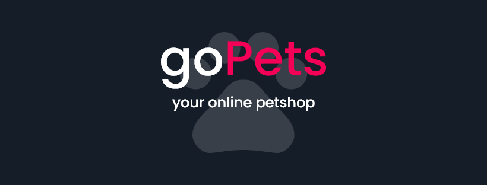

<h2 align="center">
  GoPets: your online petshop.
</h2>
<p align="center">
  Manage the pets of Petshop
</p>

# GoPets

GoPets is a dashboard app where you can manage the pets of a petshop. You can view, create, update and delete the pets.

## About the project

This project is a re-written made in Laravel. See the original [React/Node version here](https://github.com/matheuslanduci/gopets).

<br />

- <a href="#techs">Techs 💻</a>
- <a href="#responsiveness">Responsiveness 📱</a>
- <a href="#how-to-run">How to run 🚀</a>

<hr>

## Tecns

Fullstack:

- [Laravel](https://pt-br.reactjs.org)

Frontend

- [Sass](https://sass-lang.com)


## Responsiveness

The application it is responsive in these dimensions:

- 1440x900 (Desktop)
- 1024x768 (Laptop)
- 768x1024 (Tablet)
- 375x812 (Phone)

## How to run

Before running the application, be sure you have these items installed:

- [Composer 2.1.1](https://getcomposer.org)
- [WAMPServer 3.2.0](https://www.wampserver.com/en/)
- [NodeJS 14.187](https://nodejs.org/en/)
- [PHP 7.3.21](https://www.php.net/downloads)

Now, follow the instructions:

1. Open a terminal and clone the repository: 

```
$ git clone https://github.com/matheuslanduci/gopets-laravel.git
```

2. Then, go to the folder.

```
$ cd gopets
```

3. Now install the deps with Composer.

```
$ composer install
```

4. Then, set the application key with Artisan's CLI

```
$ php artisan key:generate
```

5. Run the migrations and seeds 

```
$ php artisan migrate --seed
```

6. Now you can run the app!

```
$ php artisan serve
```

Go to http://localhost:8000 
